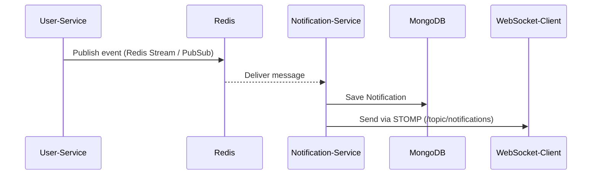

# 🔔 Notification Service - Event-Based Notification System

## 📌 Overview

The Notification Service is responsible for handling real-time and asynchronous notifications within the microservices ecosystem. It consumes user events from Redis (both Streams and Pub/Sub), stores them in MongoDB, and delivers notifications via WebSocket to subscribed clients.

---

## 🛠️ Tech Stack

- **Java 17+**
- **Spring Boot 3+**
- **Spring Data MongoDB**
- **Redis** (Streams + Pub/Sub)
- **Spring WebSocket (STOMP)**
- **Spring Security + JWT**
- **SpringDoc OpenAPI (Swagger)**
- **Eureka Client** (Service Discovery)

---

## ⚙️ Features

✅ Dual Redis listeners: **Streams** + **Pub/Sub**  
✅ Real-time WebSocket push notifications  
✅ MongoDB for persistent notification storage  
✅ Role-based access control (RBAC)  
✅ Secure endpoints using JWT  
✅ Swagger UI for API exploration  
✅ Service Discovery with Eureka

---

## 🧩 Architecture Overview

1. **Publisher**: Publishes notifications to Redis Stream (`notifications_stream`).
2. **Redis Stream Listener**: Reads messages from Redis stream and forwards them via WebSocket.
3. **Redis Subscriber**: Also listens to Redis Pub/Sub channel (`notifications`) as fallback or secondary channel.
4. **WebSocket (STOMP)**: Clients connect to `/ws` and subscribe to `/topic/notifications`.
5. **REST API**: Exposes endpoints to retrieve and send notifications.
6. **MongoDB**: Stores all notifications.

---

## 🚀 How to Run

### ✅ Prerequisites

- Java 17+
- Maven
- Redis (running locally or remotely)
- MongoDB (running locally or remotely)
- Eureka Server (must be running)

---

### 🔧 Steps

```bash
# 1. Navigate to the project directory
cd notification-service

# 2. Build the project
mvn clean install

# 3. Run the application
mvn spring-boot:run
```

---

## 🔔 Notification Flow


---

## 📡 WebSocket Info
- Endpoint: `/ws`
- Allowed Origins: `http://localhost:3000`, `http://127.0.0.1:5500`
- Subscription Destination: `/topic/notifications`
- STOMP Prefix: `/app`

---

## 📂 API Endpoints

|Method	|Endpoint	|Description	|Auth Required|
|-|-|-|-|
|POST	|`/api/notifications/send`	|Send notification (to user or global)	|✅|
|GET	|`/api/notifications/user`	|Get notifications for logged-in user	|✅|
|GET	|`/api/notifications/user/{id}`	|Get notifications for specific user	|✅|
|GET	|`/api/notifications/all`	|Get all notifications (Admin only)	|✅ (ADMIN)|
|POST	|`/api/notifications/test`	|Test endpoint (sanity check)	|❌|

---

## 🔐 Security

- JWT Authentication enabled.
- Role-based endpoint access (`@PreAuthorize`).
- CORS configured for trusted API Gateway (`http://localhost:8082`).

---

## 🧪 Swagger UI
Access at: `http://localhost:<port>/swagger-ui.html`

Auth header: Use `Bearer <token>` in "Authorize"

---

## 🛠️ Redis Config
- **Stream**: `notifications_stream`
- **Pub/Sub Channel**: `notifications`

**Both are configured and listened to concurrently.**

---

## 🗃 MongoDB Schema

```json
{
  "_id": "string",
  "message": "string",
  "recipientId": "string",
  "isGlobal": "boolean",
  "timestamp": "datetime"
}
```

---

## 💡 Future Enhancements
- **📧 Email notification support**
- **📱 Push notification (Firebase, OneSignal)**
- **📥 Notification preferences per user**
- **⏱ Expiration for global notifications**
- **📊 WebSocket status monitoring**

---

## 🧰 Troubleshooting
### ❌ Notifications Not Received in WebSocket?
- ✅ Confirm WebSocket client is subscribed to `/topic/notifications`.
- ✅ Redis is running and accessible.
- ✅ Eureka discovery is working correctly.

### ❌ Notifications Not Stored in DB?
- ✅ MongoDB is running.
- ✅ Check logs from `RedisStreamListener` and `RedisSubscriber`.

---